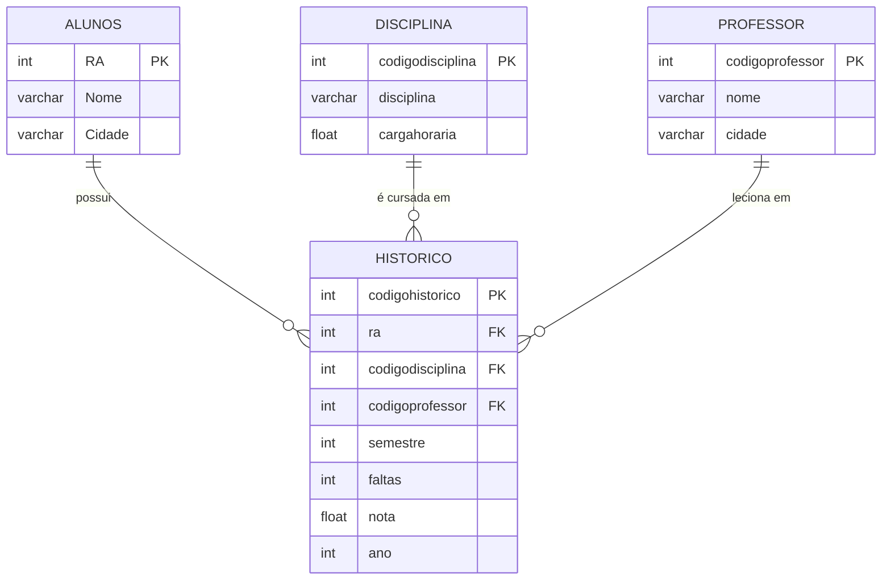

# 📚 Guia de Estudos - Banco de Dados

> **Atividade Prática para Estudos**
>
> Este repositório contém um guia completo de estudos para a disciplina de Banco de Dados, com exercícios práticos, explicações detalhadas e exemplos de código SQL. A atividade foi elaborada com base no documento - [Atividade Prática de Banco de Dados](/projects/bdTraining/docs/9%20-%20Atividade%20Banco%20de%20Dados.pdf)

## 📋 Índice

-   [📖 Visão Geral](#-visão-geral)
-   [🎯 Objetivos de Aprendizado](#-objetivos-de-aprendizado)
-   [🗂️ Estrutura do Projeto](#️-estrutura-do-projeto)
-   [💾 Modelagem do Banco de Dados](#-modelagem-do-banco-de-dados)
-   [📝 Exercícios Práticos](#-exercícios-práticos)
-   [🔧 Como Executar](#-como-executar)
-   [📚 Conceitos Importantes](#-conceitos-importantes)
-   [💡 Dicas para a Prova](#-dicas-para-a-prova)
-   [📖 Referências](#-referências)

## 📖 Visão Geral

Este projeto foi desenvolvido como material de estudo para a disciplina de Banco de Dados, focando em:

-   **Modelagem de Banco de Dados**: Criação de tabelas com relacionamentos
-   **Comandos DDL**: CREATE, ALTER, DROP
-   **Comandos DML**: INSERT, UPDATE, DELETE
-   **Consultas SQL**: SELECT com JOINs, subconsultas e funções de agregação
-   **Integridade Referencial**: Chaves primárias e estrangeiras

## 🎯 Objetivos de Aprendizado

-   ✅ Criar e gerenciar bancos de dados relacionais
-   ✅ Implementar relacionamentos entre tabelas
-   ✅ Escrever consultas SQL complexas com múltiplas junções
-   ✅ Utilizar funções de agregação e agrupamento
-   ✅ Aplicar filtros e condições avançadas
-   ✅ Manter a integridade dos dados

## 🗂️ Estrutura do Projeto (Esperado)

```
bdTraining/
├── README.md                 # Este guia de estudos
├── docs/
│   ├── querys.sql           # Todas as consultas SQL do exercício
│   ├── schema.sql           # Script de criação do banco e tabelas
│   ├── data.sql             # Script de inserção de dados
│   └── exercises/           # Exercícios organizados por tópico
│       ├── ddl-commands.md  # Comandos de definição de dados
│       ├── dml-commands.md  # Comandos de manipulação de dados
│       └── advanced-queries.md # Consultas avançadas
└── assets/
    └── diagrams/            # Diagramas ER e de relacionamento
```

## 💾 Modelagem do Banco de Dados

### Estrutura das Tabelas

#### 👨‍🎓 ALUNOS

| Campo  | Tipo         | Descrição                     |
| ------ | ------------ | ----------------------------- |
| RA     | INT PK       | Registro Acadêmico (Identity) |
| Nome   | VARCHAR(200) | Nome completo do aluno        |
| Cidade | VARCHAR(40)  | Cidade de residência          |

#### 📚 DISCIPLINA

| Campo            | Tipo         | Descrição                       |
| ---------------- | ------------ | ------------------------------- |
| codigodisciplina | INT PK       | Código da disciplina (Identity) |
| disciplina       | VARCHAR(100) | Nome da disciplina              |
| cargahoraria     | FLOAT        | Carga horária em horas          |

#### 👨‍🏫 PROFESSOR

| Campo           | Tipo         | Descrição                      |
| --------------- | ------------ | ------------------------------ |
| codigoprofessor | INT PK       | Código do professor (Identity) |
| nome            | VARCHAR(100) | Nome completo do professor     |
| cidade          | VARCHAR(40)  | Cidade de residência           |

#### 📊 HISTORICO

| Campo            | Tipo   | Descrição                      |
| ---------------- | ------ | ------------------------------ |
| codigohistorico  | INT PK | Código do histórico (Identity) |
| ra               | INT FK | Referência ao aluno            |
| codigodisciplina | INT FK | Referência à disciplina        |
| codigoprofessor  | INT FK | Referência ao professor        |
| semestre         | INT    | Semestre cursado               |
| faltas           | INT    | Número de faltas               |
| nota             | FLOAT  | Nota obtida                    |
| ano              | INT    | Ano letivo                     |

### 🔗 Relacionamentos



## 📝 Exercícios Práticos

### 🏗️ Parte 1: Criação da Estrutura

### 🔍 Parte 2: Consultas Básicas

### 🔗 Parte 3: Consultas com JOINs

### 📊 Parte 4: Consultas Avançadas

### 📁 Arquivos de Estudo

## 🔧 Como Executar

### Pré-requisitos

-   SQL Server ou SQL Server Management Studio
-   Conhecimento básico de SQL

### Passo a Passo

1. **Clone o repositório**

    ```bash
    git clone <url-do-repositorio>
    cd bdTraining
    ```

2. **Crie o banco de dados**

    ```sql
    -- Execute o arquivo schema.sql
    ```

3. **Insira os dados de teste**

    ```sql
    -- Execute o arquivo data.sql
    ```

4. **Execute as consultas**
    ```sql
    -- Execute as consultas do arquivo querys.sql
    ```

## 📚 Conceitos Importantes

### 🔑 Chaves e Relacionamentos

**Chave Primária (Primary Key)**

-   Identifica unicamente cada registro
-   Não pode ser NULL
-   Não pode ter valores duplicados

**Chave Estrangeira (Foreign Key)**

-   Estabelece relacionamento entre tabelas
-   Garante integridade referencial
-   Deve existir na tabela referenciada

### 🔗 Tipos de JOIN

| Tipo JOIN  | Descrição                                                        | Uso                                                          |
| ---------- | ---------------------------------------------------------------- | ------------------------------------------------------------ |
| INNER JOIN | Retorna apenas registros com correspondência em ambas as tabelas | Consultas que precisam de dados relacionados                 |
| LEFT JOIN  | Retorna todos os registros da tabela esquerda                    | Quando queremos todos os registros mesmo sem correspondência |
| RIGHT JOIN | Retorna todos os registros da tabela direita                     | Menos usado, similar ao LEFT JOIN                            |
| FULL JOIN  | Retorna registros quando há correspondência em qualquer tabela   | União completa de dados                                      |

### 📊 Funções de Agregação

```sql
-- Principais funções
COUNT(*)         -- Conta registros
COUNT(DISTINCT)  -- Conta valores únicos
SUM()           -- Soma valores
AVG()           -- Calcula média
MAX()           -- Valor máximo
MIN()           -- Valor mínimo
STRING_AGG()    -- Concatena strings (SQL Server)
```

### 🎯 Cláusulas Importantes

```sql
-- Estrutura básica de uma consulta
SELECT colunas
FROM tabela1
JOIN tabela2 ON condição
WHERE filtros_de_registro
GROUP BY colunas_de_agrupamento
HAVING filtros_de_grupo
ORDER BY colunas_de_ordenação;
```

## 💡 Dicas para a Prova

### ✅ Checklist de Preparação

-   [ ] **Memorizar a estrutura básica do SELECT**
-   [ ] **Praticar JOINs entre 2, 3 e 4 tabelas**
-   [ ] **Entender a diferença entre WHERE e HAVING**
-   [ ] **Conhecer as principais funções de agregação**
-   [ ] **Saber usar DISTINCT para eliminar duplicatas**
-   [ ] **Praticar comandos DDL (CREATE, ALTER)**
-   [ ] **Praticar comandos DML (INSERT, UPDATE)**

### 🎯 Estratégias para a Prova

1. **Leia a questão inteiramente** antes de começar a escrever
2. **Identifique as tabelas** que serão necessárias
3. **Determine os relacionamentos** entre as tabelas
4. **Escreva o JOIN** primeiro, depois adicione os filtros
5. **Use aliases** para deixar o código mais limpo (A, H, D, P)
6. **Teste mentalmente** se a consulta faz sentido

### ⚠️ Erros Comuns a Evitar

-   **Esquecer a condição do JOIN** (vai gerar produto cartesiano)
-   **Confundir WHERE com HAVING**
-   **Usar GROUP BY sem função de agregação**
-   **Esquecer de usar DISTINCT quando necessário**
-   **Não especificar a tabela quando há campos com mesmo nome**

### 📝 Padrões de Escrita

```sql
-- Sempre use este padrão para facilitar a leitura
SELECT DISTINCT
    A.campo1,
    B.campo2
FROM
    TABELA1 AS A
JOIN
    TABELA2 AS B ON A.chave = B.chave_estrangeira
WHERE
    A.condicao = 'valor'
    AND B.outra_condicao > 0
ORDER BY
    A.campo1;
```

## 📖 Referências

### 📚 Documentação Oficial

-   [Documentação SQL Server](https://docs.microsoft.com/en-us/sql/)
-   [Transact-SQL Reference](https://docs.microsoft.com/en-us/sql/t-sql/)

### 🎓 Tutoriais e Guias

-   [W3Schools SQL Tutorial](https://www.w3schools.com/sql/)
-   [SQL Joins Explained](https://www.sqljoins.com/)
-   [SQL Cheat Sheet](https://www.sqltutorial.org/sql-cheat-sheet/)

### 🛠️ Ferramentas

-   [SQL Server Management Studio (SSMS)](https://docs.microsoft.com/en-us/sql/ssms/)
-   [Azure Data Studio](https://docs.microsoft.com/en-us/sql/azure-data-studio/)
-   [DB Browser for SQLite](https://sqlitebrowser.org/) (Para testes rápidos)

---
